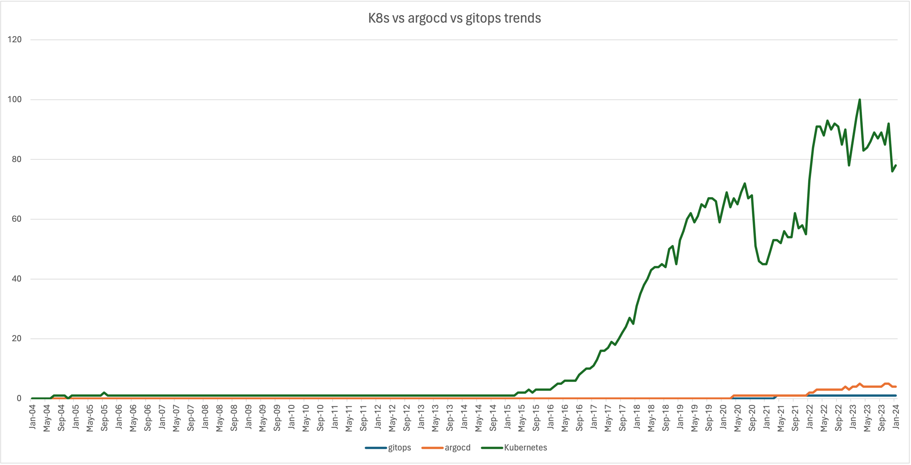

# Gitops

## What is devops?

DevOps is a methodology in the software development and IT industry that integrates and automates the work of software development (Dev) and IT operations (Ops). It is defined as a combination of cultural philosophies, practices, and tools that aim to increase an organization's ability to deliver applications and services at high velocity. DevOps emphasizes communication, collaboration, and integration between software development and IT operations teams. It leverages practices such as continuous integration/continuous delivery (CI/CD), infrastructure as code, and automation to orchestrate a production environment.
The ability to reproduce a full production environment with in minutes is key in dev ops. 

## But the subject is gitops 
GitOps uses Git repositories as a single source of truth to deliver infrastructure as code. Submitted code checks the CI process, while the CD process checks and applies requirements for things like security, infrastructure as code, or any other boundaries set for the application framework. All changes to code are tracked, making updates easy while also providing version control should a rollback be needed.

GitOps delivers:
A standard workflow for application development
Increased security for setting application requirements upfront
Improved reliability with visibility and version control through Git
Consistency across any cluster, any cloud, and any on-premise environment

### GitOps principals 
1 Declarative
A system managed by GitOps must have its desired state expressed declaratively.

2 Versioned and Immutable
Desired state is stored in a way that enforces immutability, versioning and retains a complete version history.

3 Pulled Automatically
Software agents automatically pull the desired state declarations from the source.

4 Continuously Reconciled
Software agents continuously observe actual system state and attempt to apply the desired state.

### History 

### Trends

