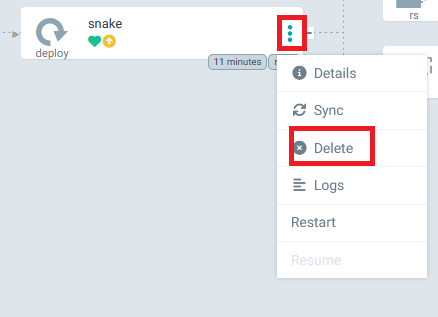

# Workshop
The goal is to setup a gitops environment perform a deployment of a stateless app.
We will use a kubernetes cluster and argocd.


## Setup K8s
rancher k8s distro will be use.
Download:
https://rancherdesktop.io/
### Windows
wsl --install

## Argo cd

### Install argoCd
Open a terminal
```
kubectl create namespace argocd
kubectl apply -n argocd -f https://raw.githubusercontent.com/argoproj/argo-cd/v2.8.9/manifests/install.yaml
kubectl get pod -n argocd
kubectl port-forward service/argocd-server 8080:80 -n argocd

```
open a new terminal tab.

#### Get argocd password Unix
```
kubectl -n argocd get secret argocd-initial-admin-secret -o jsonpath="{.data.password}" | base64 -d
```
#### Get argocd password Windows
```
kubectl -n argocd get secret argocd-initial-admin-secret -o jsonpath="{.data.password}"
```
take the output and decode it by using the following website
https://www.base64decode.org/

#### make Argocd an admin of your cluster

```
kubectl apply -f .\apps\argocd\role.yaml -n argocd
```

This apply the following yaml.
```yaml
apiVersion: rbac.authorization.k8s.io/v1
kind: ClusterRole
metadata:
  name: argocd-application-controller
rules:
  - apiGroups:
      - '*'
    resources:
      - '*'
    verbs:
      - '*'
  - nonResourceURLs:
      - '*'
    verbs:
      - '*'
---
apiVersion: rbac.authorization.k8s.io/v1
kind: ClusterRoleBinding
metadata:
  name: argocd-application-controller
roleRef:
  apiGroup: rbac.authorization.k8s.io
  kind: ClusterRole
  name: argocd-application-controller
subjects:
- kind: ServiceAccount
  name: argocd-application-controller
  namespace: argocd
```


Go to http://localhost:8080 
the username is admin

### Create an app
click on new app then edit Yaml and paste the following 

```yaml
apiVersion: argoproj.io/v1alpha1
kind: Application
metadata:
  name: snake-app
  namespace: argocd
spec:
  destination:
    namespace: snake
    server: https://kubernetes.default.svc
  project: default
  source: 
    path: apps/snake/base/
    repoURL: https://github.com/mattcauf/argocd-workshop.git
    targetRevision: main
  syncPolicy:
    automated:
      prune: true
      selfHeal: false
    syncOptions:
    - CreateNamespace=true
```
A new window will open with the newly created ressources.

This deployment contains 3 ressources:
- 1 configmap
- 1 service
- 1 deployment


### let's play with argocd
#### Introduce a diff in the running config
```
kubectl port-forward service/snake-svc 8090:80 -n snake
```
open a new terminal tab.

go to http://localhost:8090


know we will change some ressources
```
kubectl -n snake patch deploy/snake --type='json' -p='[{"op": "replace", "path": "/spec/template/spec/initContainers/0/env/0/value", "value":"blue"}]'
kubectl -n snake patch deploy/snake --type='json' -p='[{"op": "replace", "path": "/spec/template/spec/initContainers/0/env/1/value", "value":"purple"}]'
```

Snake will restart and the color should have changed. you may need to rerun 
```
kubectl port-forward service/snake-svc 8090:80 -n snake
```

Go back to argocd and open snake app.
the app is out of sync, click on sync button.


#### Make the app self heal

Delete the deployment



The app is now out of sync. For enabling selfhealing do


Delete the snake deployment again and check what is happening.

#### Make a commit 

### Exercice
Can you manage argocd 